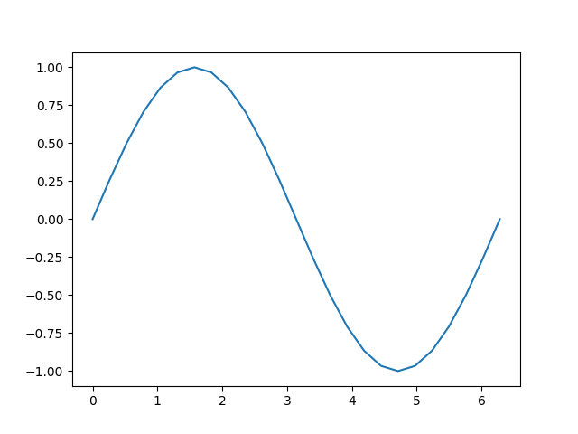
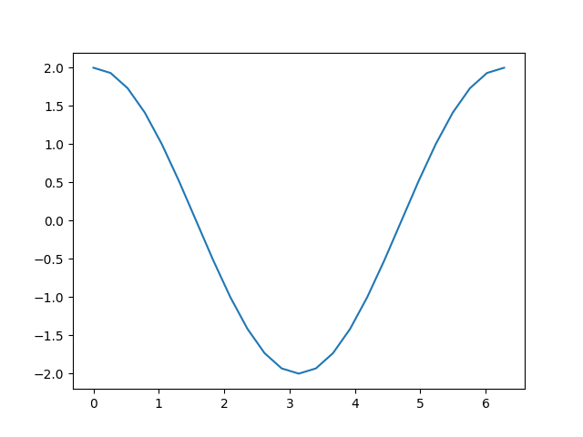

# 自动微分的基础知识

> 译者：[Fadegentle](https://github.com/Fadegentle)
>
> 项目地址：<https://pytorch.apachecn.org/2.0/tutorials/beginner/introyt/autogradyt_tutorial>
>
> 原始地址：<https://pytorch.org/tutorials/beginner/introyt/autogradyt_tutorial.html>

请跟随下面的视频或在 [youtube](https://www.youtube.com/watch?v=M0fX15_-xrY) 上观看。

<iframe width="560" height="315" src="https://www.youtube.com/embed/M0fX15_-xrY" title="The Fundamentals of Autograd" frameborder="0" allow="accelerometer; autoplay; clipboard-write; encrypted-media; gyroscope; picture-in-picture; web-share" allowfullscreen></iframe>

PyTorch 的自动微分（ Autograd ）特性使 PyTorch 在构建机器学习项目时更加灵活高效。它能快速简便地计算复杂计算中的多个偏导数（也称为梯度）。这个操作在基于反向传播的神经网络学习中起着核心作用。

自动微分的强大之处在于它能在运行时动态跟踪计算，这意味着，如果您的模型具有决策分支或长度直到运行时才知道的循环，计算仍能被正确跟踪，并获得正确的梯度来进行学习。再加上模型是用 Python 构建，比起依赖静态分析结构僵化的模型来计算梯度的框架，提供了更大的灵活性。

## 为什么我们需要自动微分呢？

一个机器学习模型就是一个有输入输出的 _函数_。在探讨中，我们将输入看作元素为 $x_i$ 的 _i_ 维向量 $\vec{x}$。我们可以将模型 $M$ 表述为输入的向量值函数：$\vec{y} = \vec{M}(\vec{x})$。（我们将 $M$ 的输出值看作一个向量，因为一般来说，一个模型可能有任意数量的输出。） 

由于我们主要是在训练的背景下讨论自动微分，因此我们要关注的输出是模型的损失。_损失函数_ $L(\vec{y}) = L(\vec{M}(\vec{x}))$ 是模型输出的单值标量函数。该函数表示模型预测与特定输入的理想输出相差多少。_注意：此后，我们一般会在上下文中清楚的情况下省略向量符号_——例如，使用 $y$ 而非 $\vec{y}$。

在训练模型时，我们希望将损失降到最低。在理想化的完美模型中，这意味着调整其学习权重（即函数的可调参数），使所有输入的损失都为零。在现实世界中，这意味着通过迭代过程，微调学习权重，直到我们看到在各种输入下获得可接受的损失。。

我们如何决定权重调整的大小和方向？我们希望将损失 _最小化_，也就是让损失对输入的一阶导数等于 0：$\frac{\partial L}{\partial x} = 0$。

但请注意，损失并 _不是直接_ 来自输入，而是模型输出（直接输入的函数）的函数，$\frac{\partial L}{\partial x} = \frac{\partial L}{\partial y} \frac{\partial y}{\partial x}$。根据微积分的链式法则，我们有 $\frac{\partial L(\vec{y})}{\partial x} = \frac{\partial L}{\partial y} \frac{\partial y}{\partial x} = \frac{\partial L}{\partial y} \frac{\partial M(x)}{\partial x}$。

从 $\frac{\partial M(x)}{\partial x}$ 开始，事情复杂了起来。如果我们再次使用链式法则展开表达式，模型输出关于其输入的偏导数，将涉及到模型中每个乘以学习权重的局部偏导数、每个激活函数以及模型中的其他数学变换。每个局部导数的完整表达式都是计算图中每条 _可能路径_（欲测量梯度的变量结束的路径）的局部梯度乘积之和。

特别是，我们对学习权重的梯度很感兴趣——它们告诉我们应该 _朝哪个方向改变每个权重_，才能使损失函数趋近于零。

由于这种局部导数（每个局部导数对应模型计算图中的一条单独路径）的数量会随着神经网络的深度呈指数级增长，因此计算它们的复杂度也会随之增加。这就是自动微分的作用所在： 它可以跟踪每次计算的历史。PyTorch 模型中的每一个计算张量都带有输入张量和创建函数的历史记录。再加上 PyTorch 中用于作用于张量的函数都有计算自身导数的内置实现，这就大大加快了学习所需的局部导数的计算速度。

## 一个简单的例子
理论有很多——但在实践中使用自动微分又如何呢？

让我们从一个简单的例子开始。首先，我们将导入一些库，以便绘制我们的结果：

```python
# %matplotlib inline

import torch

import matplotlib.pyplot as plt
import matplotlib.ticker as ticker
import math
```

然后，我们将创建一个输入张量，内含均匀分布在 $[0, 2\pi]$ 的值，并指定 `requires_grad=True`。（和大多数创建张量的函数一样，`torch.linspace()` 也能选择 `requires_grad` 。）设置此标志意味着在随后的每次计算中，自动微分都会在该次计算的输出张量中累积计算历史。

```python
a = torch.linspace(0., 2. * math.pi, steps=25, requires_grad=True)
print(a)
```

输出：
```shell
tensor([0.0000, 0.2618, 0.5236, 0.7854, 1.0472, 1.3090, 1.5708, 1.8326, 2.0944,
        2.3562, 2.6180, 2.8798, 3.1416, 3.4034, 3.6652, 3.9270, 4.1888, 4.4506,
        4.7124, 4.9742, 5.2360, 5.4978, 5.7596, 6.0214, 6.2832],
       requires_grad=True)
```

接着，我们将进行计算，并根据输入绘制输出图：

```python
b = torch.sin(a)
plt.plot(a.detach(), b.detach())
```



输出：
```shell
[<matplotlib.lines.Line2D object at 0x7f598d0477c0>]
```

让我们仔细看看张量 `b`。当我们打印它时，我们会看到一个指示器，表明它正在跟踪其计算历史：

```python
print(b)
```

输出：
```shell
tensor([ 0.0000e+00,  2.5882e-01,  5.0000e-01,  7.0711e-01,  8.6603e-01,
         9.6593e-01,  1.0000e+00,  9.6593e-01,  8.6603e-01,  7.0711e-01,
         5.0000e-01,  2.5882e-01, -8.7423e-08, -2.5882e-01, -5.0000e-01,
        -7.0711e-01, -8.6603e-01, -9.6593e-01, -1.0000e+00, -9.6593e-01,
        -8.6603e-01, -7.0711e-01, -5.0000e-01, -2.5882e-01,  1.7485e-07],
       grad_fn=<SinBackward0>)
```

这个 `grad_fn` 告诉我们，当我们执行反向传播步骤并计算梯度时，我们要为所有张量输入计算 $\sin(x)$ 的导数。

让我们再进行一些计算：

```python
c = 2 * b
print(c)

d = c + 1
print(d)
```

输出：
```shell
tensor([ 0.0000e+00,  5.1764e-01,  1.0000e+00,  1.4142e+00,  1.7321e+00,
         1.9319e+00,  2.0000e+00,  1.9319e+00,  1.7321e+00,  1.4142e+00,
         1.0000e+00,  5.1764e-01, -1.7485e-07, -5.1764e-01, -1.0000e+00,
        -1.4142e+00, -1.7321e+00, -1.9319e+00, -2.0000e+00, -1.9319e+00,
        -1.7321e+00, -1.4142e+00, -1.0000e+00, -5.1764e-01,  3.4969e-07],
       grad_fn=<MulBackward0>)
tensor([ 1.0000e+00,  1.5176e+00,  2.0000e+00,  2.4142e+00,  2.7321e+00,
         2.9319e+00,  3.0000e+00,  2.9319e+00,  2.7321e+00,  2.4142e+00,
         2.0000e+00,  1.5176e+00,  1.0000e+00,  4.8236e-01, -3.5763e-07,
        -4.1421e-01, -7.3205e-01, -9.3185e-01, -1.0000e+00, -9.3185e-01,
        -7.3205e-01, -4.1421e-01,  4.7684e-07,  4.8236e-01,  1.0000e+00],
       grad_fn=<AddBackward0>)
```

最后，我们来计算单元素输出。在没有参数的张量上调用 `.backward()` 时，它希望调用的张量只包含一个元素，计算损失函数时就是这种情况。

```python
out = d.sum()
print(out)
tensor(25., grad_fn=<SumBackward0>)
```

每个存储在张量中的 `grad_fn` 都可以通过 `next_functions` 属性追溯计算路径，直至输入。可以在下面看到，深入研究 `d` 的这一属性后，我们能看到之前所有张量的梯度函数。请注意，`a.grad_fn` 被报告为 `None`，表示这是一个没有自身历史记录的函数输入。

```python
print('d:')
print(d.grad_fn)
print(d.grad_fn.next_functions)
print(d.grad_fn.next_functions[0][0].next_functions)
print(d.grad_fn.next_functions[0][0].next_functions[0][0].next_functions)
print(d.grad_fn.next_functions[0][0].next_functions[0][0].next_functions[0][0].next_functions)
print('\nc:')
print(c.grad_fn)
print('\nb:')
print(b.grad_fn)
print('\na:')
print(a.grad_fn)
```

输出：
```shell
d:
<AddBackward0 object at 0x7f598d4ad360>
((<MulBackward0 object at 0x7f598d4ad450>, 0), (None, 0))
((<SinBackward0 object at 0x7f598d4ad450>, 0), (None, 0))
((<AccumulateGrad object at 0x7f598d4ad360>, 0),)
()

c:
<MulBackward0 object at 0x7f598d4ad450>

b:
<SinBackward0 object at 0x7f598d4ad450>

a:
None
```

有了这些机制，我们如何获得导数呢？您可以在输出上调用 `backward()` 方法，并检查输入的 `grad` 属性来查看梯度：

```python
out.backward()
print(a.grad)
plt.plot(a.detach(), a.grad.detach())
```



输出：
```shell
tensor([ 2.0000e+00,  1.9319e+00,  1.7321e+00,  1.4142e+00,  1.0000e+00,
         5.1764e-01, -8.7423e-08, -5.1764e-01, -1.0000e+00, -1.4142e+00,
        -1.7321e+00, -1.9319e+00, -2.0000e+00, -1.9319e+00, -1.7321e+00,
        -1.4142e+00, -1.0000e+00, -5.1764e-01,  2.3850e-08,  5.1764e-01,
         1.0000e+00,  1.4142e+00,  1.7321e+00,  1.9319e+00,  2.0000e+00])

[<matplotlib.lines.Line2D object at 0x7f598d487070>]
```

回想一下，我们到这里的计算步骤：

```python
a = torch.linspace(0., 2. * math.pi, steps=25, requires_grad=True)
b = torch.sin(a)
c = 2 * b
d = c + 1
out = d.sum()
```

在计算 `d` 时加入一个常数，并不会改变导数。因此，$c=2∗b=2∗\sin(a)$，其导数应为 $2∗\cos(a)$。观察上图，我们就会发现这一点。

请注意，只有计算的叶节点才会被计算梯度。举例来说，如果您尝试 `print(c.grad)`，得到的结果将是 `None`。在这个简单的例子中，只有输入是叶节点，因此只有它才会被计算梯度。

## 训练中的自动微分

我们已经简单了解了自动微分的工作原理，但使用时能如我们所愿吗？让我们定义一个小模型，看看它在一次训练后会发生怎样的变化。首先，定义几个常量、模型以及一些输入和输出的替代品：

```python
BATCH_SIZE = 16
DIM_IN = 1000
HIDDEN_SIZE = 100
DIM_OUT = 10

class TinyModel(torch.nn.Module):

    def __init__(self):
        super(TinyModel, self).__init__()

        self.layer1 = torch.nn.Linear(1000, 100)
        self.relu = torch.nn.ReLU()
        self.layer2 = torch.nn.Linear(100, 10)

    def forward(self, x):
        x = self.layer1(x)
        x = self.relu(x)
        x = self.layer2(x)
        return x

some_input = torch.randn(BATCH_SIZE, DIM_IN, requires_grad=False)
ideal_output = torch.randn(BATCH_SIZE, DIM_OUT, requires_grad=False)

model = TinyModel()
```

有件事情您可能注意到了，我们从来没有为模型的层指定 `requires_grad=True`。在 `torch.nn.Module` 的子类中，假设我们想要跟踪层的权重梯度以进行学习。

如果我们查看模型各层，便能检查权重的值，并验证尚未计算出梯度：

```python
print(model.layer2.weight[0][0:10]) # just a small slice
print(model.layer2.weight.grad)
```

输出：
```shell
tensor([ 0.0920,  0.0916,  0.0121,  0.0083, -0.0055,  0.0367,  0.0221, -0.0276,
        -0.0086,  0.0157], grad_fn=<SliceBackward0>)
None
```

让我们看看运行一个训练批次时会发生什么。对于损失函数，我们将使用 `prediction` 和 `ideal_output` 之间欧氏距离的平方，并使用基本的随机梯度下降优化器。

```python
optimizer = torch.optim.SGD(model.parameters(), lr=0.001)

prediction = model(some_input)

loss = (ideal_output - prediction).pow(2).sum()
print(loss)
```

输出：
```shell
tensor(211.2634, grad_fn=<SumBackward0>)
```

现在，让我们调用 `loss.backward()`，看看会发生什么：

```python
loss.backward()
print(model.layer2.weight[0][0:10])
print(model.layer2.weight.grad[0][0:10])
```

输出：
```shell
tensor([ 0.0920,  0.0916,  0.0121,  0.0083, -0.0055,  0.0367,  0.0221, -0.0276,
        -0.0086,  0.0157], grad_fn=<SliceBackward0>)
tensor([12.8997,  2.9572,  2.3021,  1.8887,  5.0710,  7.3192,  3.5169,  2.4319,
         0.1732, -5.3835])
```

我们可以看到，每个学习权重的梯度已经计算出来，但权重保持不变，因为我们还没有运行优化器。优化器负责根据计算出的梯度更新模型权重。

```python
optimizer.step()
print(model.layer2.weight[0][0:10])
print(model.layer2.weight.grad[0][0:10])
```

输出：
```shell
tensor([ 0.0791,  0.0886,  0.0098,  0.0064, -0.0106,  0.0293,  0.0186, -0.0300,
        -0.0088,  0.0211], grad_fn=<SliceBackward0>)
tensor([12.8997,  2.9572,  2.3021,  1.8887,  5.0710,  7.3192,  3.5169,  2.4319,
         0.1732, -5.3835])
```

您应该看到 `layer2` 的权重已经改变了。

这个过程中有一点很重要： 调用 `optimizer.step()` 后，需要调用 `optimizer.zero_grad()`，否则每次运行 `loss.backward()`，学习权重的梯度都会累积：

```python
print(model.layer2.weight.grad[0][0:10])

for i in range(0, 5):
    prediction = model(some_input)
    loss = (ideal_output - prediction).pow(2).sum()
    loss.backward()

print(model.layer2.weight.grad[0][0:10])

optimizer.zero_grad(set_to_none=False)

print(model.layer2.weight.grad[0][0:10])
```

输出：
```shell
tensor([12.8997,  2.9572,  2.3021,  1.8887,  5.0710,  7.3192,  3.5169,  2.4319,
         0.1732, -5.3835])
tensor([ 19.2095, -15.9459,   8.3306,  11.5096,   9.5471,   0.5391,  -0.3370,
          8.6386,  -2.5141, -30.1419])
tensor([0., 0., 0., 0., 0., 0., 0., 0., 0., 0.])
```

运行上面单元格后，您会发现在多次运行 `loss.backward()` 后，多数梯度都会变大很多。如果下一批训练之前没有将梯度归零，就会让梯度这样膨胀，从而造成不正确和不可预测的学习结果。

## 启停自动微分

有时，您需要对是否启用自动微分进行细粒度控制。根据情况，有多种方法可以做到这一点。

最简单的方法是直接在张量上更改 `requires_grad` 标志：

```python
a = torch.ones(2, 3, requires_grad=True)
print(a)

b1 = 2 * a
print(b1)

a.requires_grad = False
b2 = 2 * a
print(b2)
```

输出：
```shell
tensor([[1., 1., 1.],
        [1., 1., 1.]], requires_grad=True)
tensor([[2., 2., 2.],
        [2., 2., 2.]], grad_fn=<MulBackward0>)
tensor([[2., 2., 2.],
        [2., 2., 2.]])
```

在上面的单元格中，我们看到 `b1` 有一个 `grad_fn`（即跟踪计算历史），这正是我们所期望的，因为它是由张量 `a` 派生的，而张量 `a` 已开启自动微分。当我们使用 `a.requires_grad = False` 显式地关闭自动微分时，计算历史将不再被跟踪，正如我们在计算 `b2` 时所看到的那样。

如果您只需要暂时关闭自动微分，更好的方法是使用 `torch.no_grad()`：

```python
a = torch.ones(2, 3, requires_grad=True) * 2
b = torch.ones(2, 3, requires_grad=True) * 3

c1 = a + b
print(c1)

with torch.no_grad():
    c2 = a + b

print(c2)

c3 = a * b
print(c3)
```

输出：
```shell
tensor([[5., 5., 5.],
        [5., 5., 5.]], grad_fn=<AddBackward0>)
tensor([[5., 5., 5.],
        [5., 5., 5.]])
tensor([[6., 6., 6.],
        [6., 6., 6.]], grad_fn=<MulBackward0>)
```

`torch.no_grad()` 也可以用作函数或方法装饰器：

```python
def add_tensors1(x, y):
    return x + y

@torch.no_grad()
def add_tensors2(x, y):
    return x + y


a = torch.ones(2, 3, requires_grad=True) * 2
b = torch.ones(2, 3, requires_grad=True) * 3

c1 = add_tensors1(a, b)
print(c1)

c2 = add_tensors2(a, b)
print(c2)
```

输出：
```shell
tensor([[5., 5., 5.],
        [5., 5., 5.]], grad_fn=<AddBackward0>)
tensor([[5., 5., 5.],
        [5., 5., 5.]])
```

有一个相似的上下文管理器 `torch.enable_grad()`，用于在自动微分尚未开启时开启自动微分。它也可以用作装饰器。

最后，您可能有一个需要梯度跟踪的张量，但是您想要一个不需要梯度跟踪的副本。为此，我们可以使用 `Tensor` 的 `detach()` 方法——它会创建一个从计算历史中分离出来的张量副本：

```python
x = torch.rand(5, requires_grad=True)
y = x.detach()

print(x)
print(y)
```

输出：
```shell
tensor([0.0670, 0.3890, 0.7264, 0.3559, 0.6584], requires_grad=True)
tensor([0.0670, 0.3890, 0.7264, 0.3559, 0.6584])
```

当我们想要画些张量时，我们就这样做了。这是因为 `matplotlib` 期望一个 NumPy 数组作为输入，而 PyTorch 张量到 NumPy 数组的隐式转换对于 requires_grad=True 的张量是不可用的。创建一个分离的副本能让我们继续前进。

### 自动微分和原地操作

在本笔记本迄今为止的每个例子中，我们都使用变量来捕获计算的中间值。自动微分需要这些中间值计算梯度。_因此，在使用自动微分时，必须谨慎使用原地操作_。这样做可能会破坏您在 `backward()` 调用中计算导数所需的信息。如果您试图对需要自动微分的叶子变量进行就地操作，PyTorch 甚至会阻止您，如下所示。

!!! note "注意"
    能预料到，下面的代码单元格会抛出一个运行时错误。

```python
a = torch.linspace(0., 2. * math.pi, steps=25, requires_grad=True)
torch.sin_(a)
```

## 自动微分分析器
自动微分可以详细跟踪每步计算，这样的计算历史记录与时序信息相结合，将成为一个方便的分析器，而自动微分已经内置了这一功能。下面是一个快速使用示例：

```python
device = torch.device('cpu')
run_on_gpu = False
if torch.cuda.is_available():
    device = torch.device('cuda')
    run_on_gpu = True

x = torch.randn(2, 3, requires_grad=True)
y = torch.rand(2, 3, requires_grad=True)
z = torch.ones(2, 3, requires_grad=True)

with torch.autograd.profiler.profile(use_cuda=run_on_gpu) as prf:
    for _ in range(1000):
        z = (z / x) * y

print(prf.key_averages().table(sort_by='self_cpu_time_total'))
```

输出：
```shell
-------------------------  ------------  ------------  ------------  ------------  ------------  ------------  ------------  ------------  ------------  ------------
                     Name    Self CPU %      Self CPU   CPU total %     CPU total  CPU time avg     Self CUDA   Self CUDA %    CUDA total  CUDA time avg    # of Calls
-------------------------  ------------  ------------  ------------  ------------  ------------  ------------  ------------  ------------  ------------  ------------
                aten::div        51.16%       6.308ms        51.16%       6.308ms       6.308us      16.511ms        50.67%      16.511ms      16.511us          1000
                aten::mul        48.67%       6.001ms        48.67%       6.001ms       6.001us      16.072ms        49.33%      16.072ms      16.072us          1000
    cudaDeviceSynchronize         0.18%      22.000us         0.18%      22.000us      22.000us       0.000us         0.00%       0.000us       0.000us             1
-------------------------  ------------  ------------  ------------  ------------  ------------  ------------  ------------  ------------  ------------  ------------
Self CPU time total: 12.331ms
Self CUDA time total: 32.583ms
```

分析器还可以标注代码的各个子块，按输入张量形状细分数据，并将数据导出为 Chrome 浏览器跟踪工具文件。有关 API 的详细信息，请参阅[文档](https://pytorch.org/docs/stable/autograd.html#profiler)。

## 进阶主题：更多的自动微分细节和高级 API

如果您有一个 `n` 维输入和 `m` 维输出的函数，$\vec{y}=f(\vec{x})$，完整梯度是各输出关于各输入的导数矩阵，称为 Jacobian：

$$
J=\begin{pmatrix}
    \frac{\partial y_1}{\partial x_1} & \cdots & \frac{\partial y_1}{\partial x_n} \\
    \vdots & \ddots & \vdots \\
    \frac{\partial y_m}{\partial x_1} &  \cdots & \frac{\partial y_m}{\partial x_n}
\end{pmatrix}
$$

如果您有第二个函数，$l=g(\vec{y})$，它接受 `m` 维输入（即与上述输出维度相同）并返回标量输出，那么您可以用列向量 $v=\begin{pmatrix}\frac{\partial l}{\partial y_1} & \cdots & \frac{\partial l}{\partial y_m}\end{pmatrix}^T$ 来表示它相对于 $\vec{y}$ 的梯度——这实际上只是一个单列 Jacobian 。

更具体地说，想象一下，第一个函数是您的 PyTorch 模型（可能有许多输入输出），第二个函数是一个损失函数（模型的输出作为输入，损失值作为标量输出）。

如果将第一个函数的 Jacobian 矩阵乘以第二个函数的梯度，然后应用链式法则，就可以得到：

$$
J^T \cdot b=\begin{pmatrix}
    \frac{\partial y_1}{\partial x_1} & \cdots & \frac{\partial y_m}{\partial x_1} \\
    \vdots & \ddots & \vdots \\
    \frac{\partial y_1}{\partial x_n} &  \cdots & \frac{\partial y_m}{\partial x_n}
\end{pmatrix} \begin{pmatrix}
    \frac{\partial l}{\partial y_1} \\
    \vdots \\
    \frac{\partial l}{\partial y_m} \\
\end{pmatrix} = \begin{pmatrix}
    \frac{\partial l}{\partial x_1} \\
    \vdots \\
    \frac{\partial l}{\partial x_n} \\
\end{pmatrix}
$$
 
请注意，您也能使用等效的操作 $v^T \cdot J$，然后得到一个行向量。

由此得到的列向量就是 _第二个函数相对于第一个函数输入的梯度_——或者说，在我们的模型和损失函数中，损失相对于模型输入的梯度。

**`torch.autograd` 是计算这些乘积的引擎**，我们就是这样在后向传递过程中累积学习权重的梯度的。

因此，`backward()` 调用也可以接受一个可选的向量输入。该向量代表一组张量上的梯度，并与前面自动微分跟踪张量的 Jacobian 相乘。让我们用一个小向量举个具体例子：

```python
x = torch.randn(3, requires_grad=True)

y = x * 2
while y.data.norm() < 1000:
    y = y * 2

print(y)
```

输出：
```shell
tensor([  299.4868,   425.4009, -1082.9885], grad_fn=<MulBackward0>)
```

如果我们现在尝试调用 `y.backward()`，会出现运行时错误，并提示只能对标量输出 _隐式_ 计算梯度。对于多维输出，自动微分希望我们提供这三个输出的梯度，以便能与 Jacobian 相乘：

```python
v = torch.tensor([0.1, 1.0, 0.0001], dtype=torch.float) # stand-in for gradients
y.backward(v)

print(x.grad)
```

输出：
```shell
tensor([1.0240e+02, 1.0240e+03, 1.0240e-01])
```

（请注意，输出梯度都与 2 的幂次有关——这与重复的倍增操作是一致的。）

### 高级 API

自动微分有一个 API 能让您直接访问重要的微分矩阵和向量操作。特别是，它允许您计算特定输入的特定函数的 Jacobian 矩阵和 _Hessian_ 矩阵。（ Hessian 矩阵与 Jacobian 矩阵类似，但表达的是所有部分 _二阶_ 导数）。它还提供了与这些矩阵进行向量乘积的方法。

让我们以一个简单函数的 Jacobian 为例，对 2 个单元素输入进行评估：

```python
def exp_adder(x, y):
    return 2 * x.exp() + 3 * y

inputs = (torch.rand(1), torch.rand(1)) # arguments for the function
print(inputs)
torch.autograd.functional.jacobian(exp_adder, inputs)
```

输出：
```shell
(tensor([0.7212]), tensor([0.2079]))

(tensor([[4.1137]]), tensor([[3.]]))
```

如果您仔细看，第一个输出应该等于 $2e^x$（因为 $e^x$ 的导数是 $e^x$），第二个值应该是 3。

当然，您也可以用高阶张量来实现这一点：

```python
inputs = (torch.rand(3), torch.rand(3)) # arguments for the function
print(inputs)
torch.autograd.functional.jacobian(exp_adder, inputs)
```

输出：
```shell
(tensor([0.2080, 0.2604, 0.4415]), tensor([0.5220, 0.9867, 0.4288]))

(tensor([[2.4623, 0.0000, 0.0000],
        [0.0000, 2.5950, 0.0000],
        [0.0000, 0.0000, 3.1102]]), tensor([[3., 0., 0.],
        [0., 3., 0.],
        [0., 0., 3.]]))
```

`torch.autograd.functional.hessian()`方法的工作原理与此相同（假设函数是二次微分的），但返回的是所有二阶导数的矩阵。

如果您提供向量，还有一个函数可以直接计算向量与 Jacobian 的积：

```python
def do_some_doubling(x):
    y = x * 2
    while y.data.norm() < 1000:
        y = y * 2
    return y

inputs = torch.randn(3)
my_gradients = torch.tensor([0.1, 1.0, 0.0001])
torch.autograd.functional.vjp(do_some_doubling, inputs, v=my_gradients)
```

输出：
```shell
(tensor([-665.7186, -866.7054,  -58.4194]), tensor([1.0240e+02, 1.0240e+03, 1.0240e-01]))
```

`torch.autograd.functional.jvp()` 方法执行与 `vjp()` 相同的矩阵乘法，但操作数相反。`vhp()` 和 `hvp()` 方法也是对向量和 Hessian 乘积执行相同的操作。

更多相关信息，请参阅[功能 API 文档](https://pytorch.org/docs/stable/autograd.html#functional-higher-level-api)。